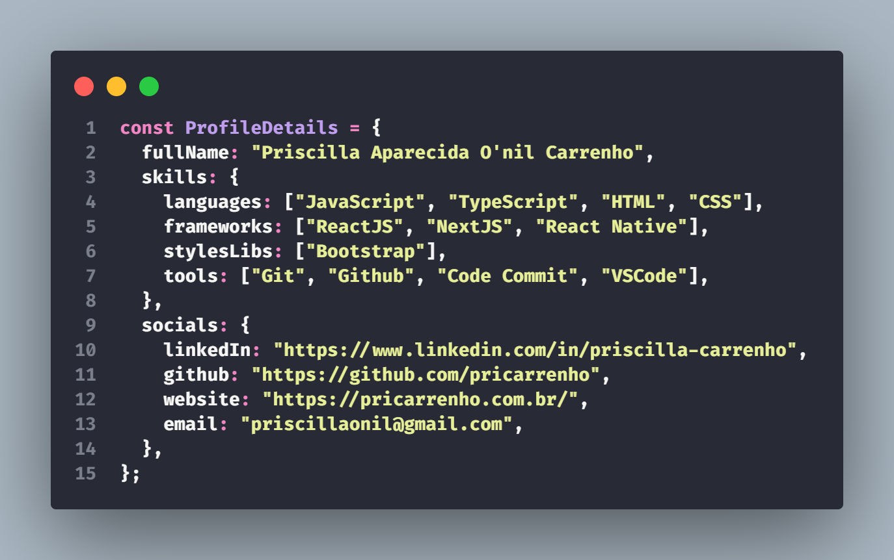

    

## Olá Devs!

Meu nome é **Priscilla** e sou iniciante nesse universo da programação. Apaixonada pela área e por tomar café, faço os dois todos os dias. Afinal minha determinação e estomago de aço são minhas melhores qualidades. Sou desenvolvedora **Front End** com foco em **JavaScript**, em especial com **ReactJS**.

 

## 📝 CONTATO

 

## ⚔ TECNOLOGIAS E FERRAMENTAS

<code></code>
<code></code>
<code></code>
<code></code>
<code></code>
<code></code>
<code></code>
<code></code>
<code></code>
<code></code>
<code></code>
<code></code>
